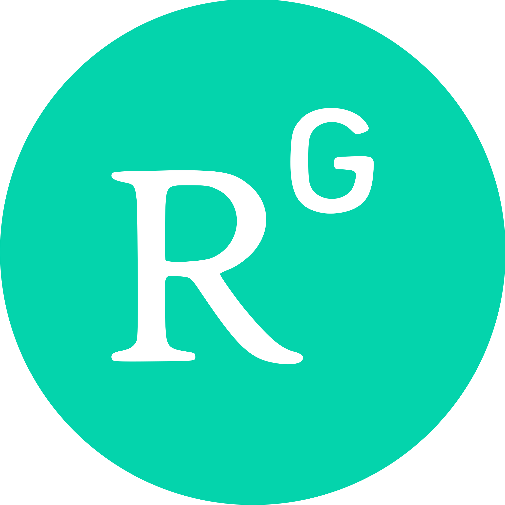

# Hi there 👋

<!-- 
可参考
https://github.com/samarjitsahoo/samarjitsahoo/blob/main/README.md?plain=1
-->

  

I'm [Shuang Song](https://cv.songshgeo.com/), a Postdoctoral researcher at Max Planck Institute of Geoanthropology. I am leading the **[SongshGeo Lab](https://github.com/SongshGeoLab)** team, focusing on **Social-Ecological Systems** research through computational modeling.

[🧑‍🔬 Academic CV](https://cv.songshgeo.com) | [✍️ Travel posts (in Chinese)](https://songshgeo.com) | [📷 Photography](https://pt.songshgeo.com/)

---

<!-- 
|  |  |
| ------------- | ------------- |
-->

<!--
**SongshGeo/SongshGeo** is a ✨ _special_ ✨ repository because its `README.md` (this file) appears on your GitHub profile.

Here are some ideas to get you started:

- 🔭 I’m currently working on ...
- 🌱 I’m currently learning ...
- 👯 I’m looking to collaborate on ...
- 🤔 I’m looking for help with ...
- 💬 Ask me about ...
- 📫 How to reach me: ...
- 😄 Pronouns: ...
- ⚡ Fun fact: ...
-->

<h3 align="center">Most Wanted Language</h3>

  

  

   

<!--Trophy-->

  

  
  
  
  
  

<!-- 

  

 -->
<h3 align="center">Connect with Me</h3>

  
  &nbsp;&nbsp;&nbsp;
  
  &nbsp;&nbsp;&nbsp;
  
  &nbsp;&nbsp;&nbsp;
  

  <a href="README_zh.md">中文</a> | <strong>English</strong> | <a href="README_en.md">Read Full Version</a>

